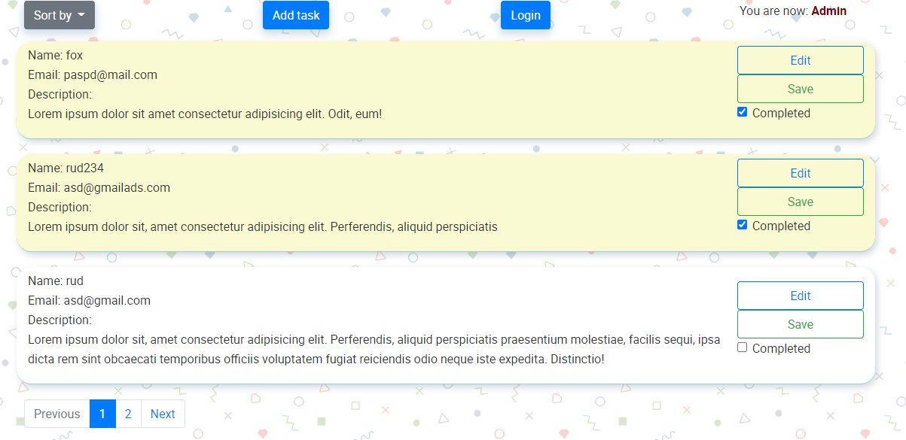

<h1>Tasks book on PHP</h1>

Необходимо создать приложение-задачник.
Задачи состоят из:
- имени пользователя;
- е-mail;
- текста задачи;

Стартовая страница - список задач с возможностью сортировки по имени пользователя, email и статусу. 
Вывод задач нужно сделать страницами по 3 штуки (с пагинацией). 
Видеть список задач и создавать новые может любой посетитель без авторизации.

Сделайте вход для администратора (логин "admin", пароль "123"). 
Администратор имеет возможность редактировать текст задачи и поставить галочку о выполнении. 

Фреймворки PHP использовать нельзя. 
Этому приложению не нужна сложная архитектура, решите поставленные задачи минимально необходимым количеством кода. 
Верстка на bootstrap, к дизайну особых требований нет.

	

